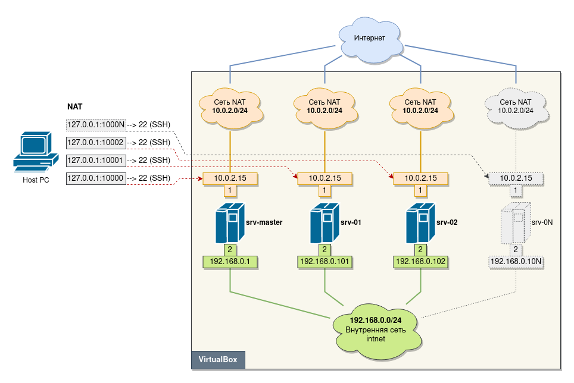

## Ручная настройка тестового стенда на VirtualBox 
# Настройка тестового стенда на VirtualBox

## Содержание
1. [Введение](#intro)
2. [Ручная настройка стенда](#manual_setup)
    * [Настройка хоста](#host_setup)
    * [Создание эталонной ВМ](#create_ref_vm)
    * [Установка гостевой ОС на эталонную ВМ](#guest_os_create)
    * [Настройка гостевой ОС на эталонной ВМ](#guest_os_setup)
    * [Клонирование виртуальной машины](#clone_ref_vm)
    * [Настройка виртуальных машин](#guests_setup)
        - [Настройка мастер-сервера](#master_setup)
        - [Настройка серверов](#common_setup)
3. [Настройка стенда с использованием Vagrant](#vagrant_setup)


## 1. Введение <a name="intro"></a>
Тестовый стенд на основе [Debian 11.6](https://www.debian.org/download).

  


## 2. Ручная настройка стенда <a name="manual_setup"></a>

### Настройка хоста <a name="host_setup"></a>

Создание (если нет) пары сертификатов для удаленного доступа на виртуальные машины через SSH по ключу:
```sh
mkdir ~/.ssh/keys-test-lab

# -o использоваеть новый формат хранения ключей, обязателен для ed25519
# -a 256 используем 256 раундов для генерации ключа -- чем больше тем безопаснее, но и медленнее
# -С комментарий, чтобы понимать в дальнейшем для кого был создан ключ
# -N без ввода парольной фразы
ssh-keygen -o -a 256 -t ed25519 -f ~/.ssh/keys-test-lab/dex -C "Test-lab-key-$(hostname)-$(date +'%d-%m-%Y')" -N ''
```
Настройка псевдонимов в файле `~./ssh/config` для большего удобства подключения к виртуальным машинам стенда:
```
Host srv-master
    HostName 127.0.0.1
    Port 10000
    User dex
    UserKnownHostsFile /dev/null
    StrictHostKeyChecking no
    IdentityFile "~/.ssh/keys-test-lab/dex"

Host srv-01
    HostName 127.0.0.1
    Port 10001
    User dex
    UserKnownHostsFile /dev/null
    StrictHostKeyChecking no
    IdentityFile "~/.ssh/keys-test-lab/dex"

Host srv-02
    HostName 127.0.0.1
    Port 10002
    User dex
    UserKnownHostsFile /dev/null
    StrictHostKeyChecking no
    IdentityFile "~/.ssh/keys-test-lab/dex"

Host srv-03
    HostName 127.0.0.1
    Port 10003
    User dex
    UserKnownHostsFile /dev/null
    StrictHostKeyChecking no
    IdentityFile "~/.ssh/keys-test-lab/dex"
```

### Создание эталонной ВМ <a name="create_ref_vm"></a>

Необходимо создать ВМ со следующими параметрами:  
- ОЗУ: 1024 МБ  
- Динамический диск 4 ГБ  
- 2 ЦП  
- Отключить аудио  

```
# Создание и регистрация ВМ
VBoxManage createvm \
    --name "srv-master" \
    --groups "/Обучение" \
    --ostype Debian_64 \
    --register

VBoxManage modifyvm "srv-master" \
    --memory 1024 \
    --rtcuseutc on \
    --cpus 2 \
    --pae off \
    --vram 16 \
    --graphicscontroller vmsvga \
    --audio none \
    --natpf1 "SSH,tcp,127.0.0.1,10000,,22" \
    --nic2 intnet

# Создание и подключение диска к ВМ
# 1/3. Создание образа диска
VBoxManage createhd \
    --filename "$HOME""/VirtualBox VMs/Обучение/srv-master/srv-master.vdi" \
    --size 5120 \
    --variant Standard

# 2/3. Добавление контроллера
VBoxManage storagectl "srv-master" \
    --name "SATA Controller" \
    --add sata \
    --portcount 1 \
    --bootable on

# 3/3. Подключение диска к контроллеру
VBoxManage storageattach "srv-master" \
    --storagectl "SATA Controller" \
    --port 0 \
    --device 0 \
    --type hdd \
    --medium "$HOME""/VirtualBox VMs/Обучение/srv-master/srv-master.vdi"

# Подключение образа диска с гостевой ОС
# 1/2. Создание контроллера
VBoxManage storagectl "srv-master" \
    --name "IDE Controller" \
    --add ide

#2/2. Подключение образа диска к ВМ
VBoxManage storageattach "srv-master" \
    --storagectl "IDE Controller" \
    --port 0 \
    --device 0 \
    --type dvddrive \
    --medium "$HOME""/iso/debian-11.6.0-amd64-netinst.iso"
```


  
  
  


### Установка гостевой ОС на эталонную ВМ <a name="guest_os_create"></a>

Ручная установка гостевой ОС.  
Необходимо разрешить sudo. Учетные данные пользователя: `dex` / `1234` .  


### Настройка гостевой ОС на эталонной ВМ <a name="guest_os_setup"></a>

Действие на хосте:
```
# копирование в гостевую ОС публичного ключа
sshpass -p '1234' ssh-copy-id -i ~/.ssh/keys-test-lab/dex.pub srv-master

# копирование пары ключей для соединения с другими машинами
scp ~/.ssh/keys-test-lab/dex* srv-master:/home/dex/.ssh
```

Для уменьшения времени выбора в меню загрузки Grub необходимо в файле `/boot/grub/grub.cfg` найти следующие строки:
```
set timeout_style=menu
set timeout=5
```
и изменить значение `timeout` на 0.

Для отключения IPv6 необходимо добавить в конец файла `/etc/sysctl.conf` строку:
```
sudo -s
echo "net.ipv6.conf.all.disable_ipv6 = 1" >> /etc/sysctl.conf
sysctl -p
```
Для настройки сетевого интерфейса внтуренней сети необходимо в конец файла `/etc/network/interfaces` добавить следующие строки:
```
allow-hotplug enp0s8
iface enp0s8 inet static
address 192.168.0.1
network 192.168.0.0
netmask 255.255.255.0
broadcast 192.168.0.255
```
И перезапустить службу:
```
systemctl restart ifup@enp0s8
```

Установка дополнительных пакетов:
```sh
apt-get update -y && apt-get upgrade
apt-get install -y curl htop neofetch mc tree
```

```
Host srv-master
    HostName 192.168.0.1
    User dex
    UserKnownHostsFile /dev/null
    StrictHostKeyChecking no
    IdentityFile "~/.ssh/dex"

Host srv-01
    HostName 192.168.0.101
    User dex
    UserKnownHostsFile /dev/null
    StrictHostKeyChecking no
    IdentityFile "~/.ssh/dex"

Host srv-02
    HostName 192.168.0.102
    User dex
    UserKnownHostsFile /dev/null
    StrictHostKeyChecking no
    IdentityFile "~/.ssh/dex"

Host srv-03
    HostName 192.168.0.103
    User dex
    UserKnownHostsFile /dev/null
    StrictHostKeyChecking no
    IdentityFile "~/.ssh/dex"
```
дополнение к файлу `/etc/hosts`:
```
192.168.0.1     srv-master
192.168.0.101   srv-01
192.168.0.102   srv-02
192.168.0.103   srv-03
```


### Клонирование виртуальной машины <a name="clone_ref_vm"></a>


### Настройка виртуальных машин <a name="guests_setup"></a>

#### Настройка мастер-сервера <a name="master_setup"></a>
#### Настройка серверов <a name="common_setup"></a>

